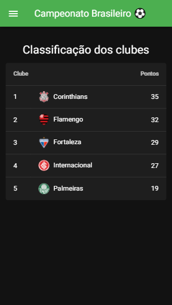

# Campeonato Brasileiro
Projeto de uma aplicação Front-End em VueJS que traz informações (fictícias) sobre o campeonato brasileiro.  
Desenvolvido durante o treinamento para o Hackathon Decola (Edição Luna), da Iteris. 

## Tela 1: Início

## ‌Tela 2: Classificação dos clubes

# Lista de tarefas
- Iniciar o projeto
- Instalar o [Vuetify](https://vuetifyjs.com)
- Adicionar o menu
- Criar tela 1: Início
- Adicionar rotas com o vue-router
- Criar tela 2: Classificação dos clubes
- Ordenar os clubes em ordem decrescente